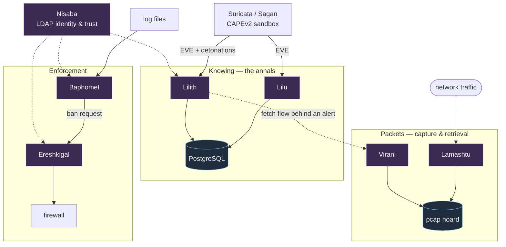

# The Pantheon

The LilithSec daemons each depend on none of the others to run, but they were
designed as one household. This page is the map of how they interlink — the one
piece of documentation that belongs to no single repo.

## The cast, in one line each

| Daemon | In the world above |
|---|---|
| **[Lilith](https://github.com/LilithSec/Lilith)** | Ingests sensor alerts into PostgreSQL; search CLI + web frontend; auto-escalation |
| **[Lilu](https://github.com/LilithSec/App-Lilu)** | Ingest-only Lilith for sensor boxes; writes Lilith's tables |
| **[Baphomet](https://github.com/VVelox/Baphomet)** | Log watcher (fail2ban family); counts offenses; sends ban requests |
| **[Ereshkigal](https://github.com/LilithSec/Ereshkigal)** | Receives ban requests and firewalls the condemned |
| **[Lamashtu](https://github.com/LilithSec/Lamashtu)** | Packet-capture manager; hoards rotating pcaps (full packet capture) |
| **[Virani](https://github.com/LilithSec/Virani)** | PCAP retrieval; serves the flow behind an alert out of Lamashtu's hoard |
| **[Nisaba](https://github.com/VVelox/Plugtools)** | LDAP user/group/netgroup manager; the household's identity and trust store |

## How the work flows

Three threads run through the household — knowing, packets, and enforcement —
with Nisaba's identity store underneath them all.

## The three threads

**Detection → the annals.** [Suricata](https://suricata.io/) and
[Sagan](https://github.com/quadrantsec/sagan) raise the cries; the sandbox
([CAPEv2](https://github.com/kevoreilly/CAPEv2)) adds detonation reports.
[Lilith](https://github.com/LilithSec/Lilith) gathers all of it into PostgreSQL
and consults it. On sensor boxes that hold no court of their own,
[Lilu](https://github.com/LilithSec/App-Lilu) does just the carrying — writing
the *same* tables into a Lilith database with a far smaller dependency chain —
while a central Lilith does the searching and escalating over everything the
sensors brought in.

**An alert → its packets.** [Lamashtu](https://github.com/LilithSec/Lamashtu)
hoards a copy of everything crossing the wire. When you want the packets
*behind* a particular alert, [Lilith](https://github.com/LilithSec/Lilith) sends
[Virani](https://github.com/LilithSec/Virani) — Virani reads the window out of
Lamashtu's hoard and hands back the flow. Lamashtu remembers; Virani reads what
she kept.

**A log line → a ban.** [Baphomet](https://github.com/VVelox/Baphomet) watches
logs the way fail2ban does, counts each IP's offenses, and when one crosses the
line sends a ban request to
[Ereshkigal](https://github.com/LilithSec/Ereshkigal), who does the actual
firewalling. Baphomet accuses; Ereshkigal punishes.

**Underneath all of it,** [Nisaba](https://github.com/VVelox/Plugtools) keeps
the rolls — the LDAP `posixAccount`, `posixGroup`, and `nisNetgroup` entries and
the trust marks (passwords, SSH keys, TOTP, passkeys) that the household
authenticates against. Before anything is judged, granted, or taken away,
someone must keep the record of who exists and what house they belong to. That
is Nisaba's work.
